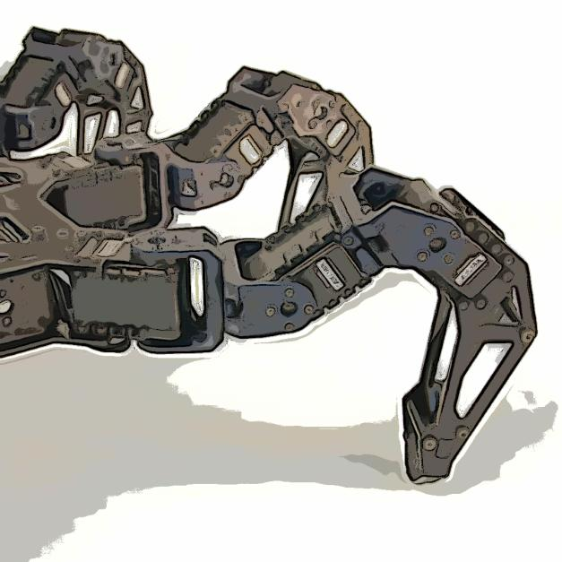

# B3 2020 - Hexapode ChacalSixPattes
_By our team ChacalSixPattes, with CANETOS Constantin, INGRAND Loïc, MOUSSETAFA Moïse,	ORTO Dylan_
 

All usefull codes of hexapode simulation in : **0-Simulation**

Some GIFs of coded functions on simulation : 
https://imgur.com/a/75zg18r

---

# Requirements

- A git account setuped : [git tutorial](https://www.atlassian.com/git/tutorials/setting-up-a-repository) if needed.
- Clone this repository, the code base 
```bash
git clone git@bitbucket.org:RemiFabre/robotics_initiation.git
```
- Install the Pypot library: https://github.com/poppy-project/pypot
```bash
python3 setup.py install --user
```

# This project
- is private for the team, all team members and the teacher have access to this.
- have some README.md that explain how to use the work
- is licensed under the MT Licence - see the LICENSE file for details
- use for base Robotics initiation class materials by Remi Fabre and Steve N'Guyen, licensed under a [Creative Commons Attribution 4.0 International License](https://creativecommons.org/licenses/by/4.0/), and modified by our team with the authorization.
